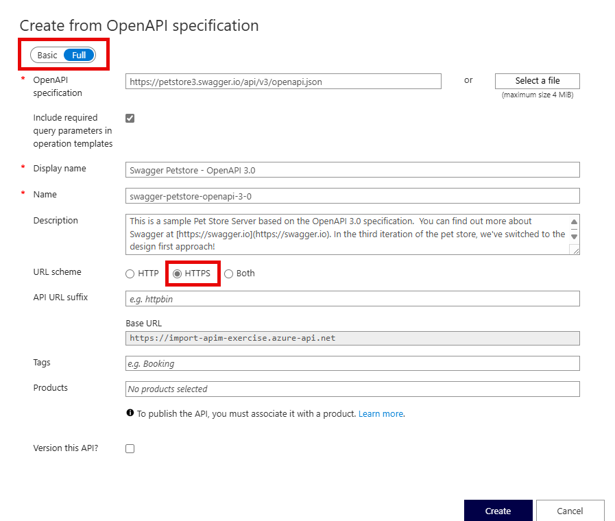

---
lab:
  topic: Azure API Management
  title: Importieren und Konfigurieren einer API mit Azure API Management
  description: 'Hier erfahren Sie, wie Sie eine API importieren, veröffentlichen und testen, die der OpenAPI-Spezifikation entspricht.'
---

# Importieren und Konfigurieren einer API mit Azure API Management

In dieser Übung erstellen Sie eine Azure API Management-Instanz, Sie importieren eine Back-End-API für die OpenAPI-Spezifikation, Sie konfigurieren die API-Einstellungen einschließlich der Webdienst-URL und Abonnementanforderungen, und Sie testen die API-Vorgänge, um sicherzustellen, dass diese ordnungsgemäß funktionieren.

In dieser Übung ausgeführte Aufgaben:

* Erstellen einer Azure API Management-Instanz (APIM)
* Importieren einer API
* Konfigurieren der Back-End-Einstellungen
* Testen der API

Diese Übung dauert etwa **20** Minuten.

## Erstellen einer API Management-Instanz

In diesem Abschnitt der Übung erstellen Sie eine Ressourcengruppe und Azure Storage-Konto. Sie notieren auch den Endpunkt und den Zugriffsschlüssel für das Konto.

1. Navigieren Sie in Ihrem Browser zum Azure-Portal [https://portal.azure.com](https://portal.azure.com) und melden Sie sich mit Ihren Azure-Anmeldeinformationen an, wenn Sie dazu aufgefordert werden.

1. Verwenden Sie die Schaltfläche **[\>_]** rechts neben der Suchleiste oben auf der Seite, um eine neue Cloud Shell im Azure-Portal zu erstellen, und wählen Sie eine ***Bash***-Umgebung aus. Die Cloud Shell bietet eine Befehlszeilenschnittstelle in einem Bereich am unteren Rand des Azure-Portals. Wenn Sie aufgefordert werden, ein Speicherkonto auszuwählen, damit Ihre Dateien beibehalten werden, wählen Sie **Kein Speicherkonto erforderlich**, Ihr Abonnement und dann **Anwenden** aus.

    > **Hinweis**: Wenn Sie zuvor eine Cloud Shell erstellt haben, die eine *PowerShell*-Umgebung verwendet, wechseln Sie diese zu ***Bash***.

1. Erstellen Sie eine Ressourcengruppe für die Ressourcen, die für diese Übung benötigt werden. Ersetzen Sie **myResourceGroup** durch einen Namen, den Sie für die Ressourcengruppe verwenden möchten. Sie können **eastus2** bei Bedarf durch eine Region in Ihrer Nähe ersetzen. Wenn Sie bereits über eine Ressourcengruppe verfügen, die Sie verwenden möchten, fahren Sie mit dem nächsten Schritt fort.

    ```azurecli
    az group create --location eastus2 --name myResourceGroup
    ```

1. Erstellen Sie einige Variablen für die zu verwendenden CLI-Befehle. Dadurch wird die Menge an Eingaben reduziert. Ersetzen Sie **myLocation** durch den zuvor von Ihnen ausgewählten Wert. Der APIM-Name muss ein global eindeutiger Name sein, und mit dem folgenden Skript wird eine zufällige Zeichenfolge generiert. Ersetzen Sie **myEmail** durch eine E-Mail-Adresse, für die Sie Zugriff haben.

    ```bash
    myApiName=import-apim-$RANDOM
    myLocation=myLocation
    myEmail=myEmail
    ```

1. Erstellen einer APIM-Instanz. Der Befehl **az apim create** wird zum Erstellen einer Instanz verwendet. Ersetzen Sie **myResourceGroup** durch den zuvor von Ihnen ausgewählten Wert.

    ```bash
    az apim create -n $myApiName \
        --location $myLocation \
        --publisher-email $myEmail  \
        --resource-group myResourceGroup \
        --publisher-name Import-API-Exercise \
        --sku-name Consumption 
    ```
    > **Hinweis:** Der Vorgang sollte innerhalb von etwa fünf Minuten abgeschlossen sein. 

## Importieren einer Back-End-API

In diesem Abschnitt wird gezeigt, wie Sie eine Back-End-API mit OpenAPI-Spezifikation importieren und veröffentlichen.

1. Suchen Sie im Azure-Portal nach **API Management-Dienste**, und wählen Sie die entsprechende Option aus.

1. Wählen Sie auf dem Bildschirm **API Management-Dienste** die von Ihnen erstellte API Management-Instanz aus.

1. Wählen Sie im Navigationsbereich **API Management-Dienst** die Option **> APIs** und dann **APIs** aus.

    


1. Wählen Sie im Abschnitt **Aus Definition erstellen** die Option **OpenAPI** aus, und legen Sie im daraufhin angezeigten Popupfenster die Umschaltfläche **Standard/Vollständig** auf **Vollständig** fest.

    

    Verwenden Sie die Werte aus der folgenden Tabelle, um das Formular auszufüllen. Sie können den Standardwert für alle nicht erwähnten Felder beibehalten.

    | Einstellung | Wert | BESCHREIBUNG |
    |--|--|--|
    | **OpenAPI-Spezifikation** | `https://bigconference.azurewebsites.net/` | Verweist auf den Dienst, der die API implementiert. Anforderungen werden an diese Adresse weitergeleitet. Die meisten erforderlichen Informationen im Formular werden automatisch aufgefüllt, nachdem Sie diesen Wert eingegeben haben. |
    | **URL-Schema** | Wählen Sie **HTTPS** aus. | Definiert die Sicherheitsstufe des HTTP-Protokolls, das von der API akzeptiert wird. |

1. Klicken Sie auf **Erstellen**.

## Konfigurieren der API-Einstellungen

Die *Big Conference-API* wird erstellt. Jetzt können Sie die API-Einstellungen zu konfigurieren. 

1. Wählen Sie im Menü **Einstellungen** aus.

1. Geben Sie in das Feld **Webdienst-URL** `https://bigconference.azurewebsites.net/` ein.

1. Deaktivieren Sie das Kontrollkästchen **Abonnement erforderlich**.

1. Wählen Sie **Speichern**.

## Testen der API

Nachdem die API importiert und konfiguriert wurde, ist es an der Zeit, die API zu testen.

1. Wählen Sie auf der Menüleiste **Testen** aus. Dadurch werden alle in der API verfügbaren Vorgänge angezeigt.

1. Suchen Sie nach dem Vorgang **Speakers_Get**, und wählen Sie ihn aus. 

1. Wählen Sie **Send** (Senden) aus. Möglicherweise müssen Sie auf der Seite nach unten scrollen, um die HTTP-Antwort anzuzeigen.

    Das Back-End antwortet mit **200 OK** und einigen Daten.

## Bereinigen von Ressourcen

Nachdem Sie die Übung beendet haben, sollten Sie die von Ihnen erstellten Cloud-Ressourcen löschen, um eine unnötige Ressourcennutzung zu vermeiden.

1. Navigieren Sie zu der Ressourcengruppe, die Sie erstellt haben, und zeigen Sie den Inhalt der in dieser Übung verwendeten Ressourcen an.
1. Wählen Sie auf der Symbolleiste die Option **Ressourcengruppe löschen** aus.
1. Geben Sie den Namen der Ressourcengruppe ein, und bestätigen Sie, dass Sie sie löschen möchten.

> **VORSICHT:** Beim Löschen einer Ressourcengruppe werden alle darin enthaltenen Ressourcen gelöscht. Wenn Sie eine vorhandene Ressourcengruppe für diese Übung ausgewählt haben, werden alle vorhandenen Ressourcen ebenfalls gelöscht, die nicht in dieser Übung verwendet werden.
