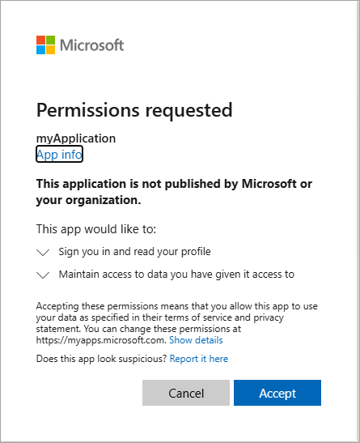

---
lab:
  topic: Azure authentication and authorization
  title: Implementieren der interaktiven Authentifizierung mit MSAL.NET
  description: 'Hier erfahren Sie, wie Sie die interaktive Authentifizierung mithilfe des MSAL.NET-SDK implementieren und ein Token abrufen.'
---

# Implementieren der interaktiven Authentifizierung mit MSAL.NET

In dieser Übung registrieren Sie eine Anwendung bei Microsoft Entra ID, und Sie erstellen anschließend eine .NET-Konsolenanwendung, die MSAL.NET verwendet, um eine interaktive Authentifizierung durchzuführen und ein Zugriffstoken für Microsoft Graph abzurufen. Sie erfahren, wie Sie Authentifizierungsbereiche konfigurieren, die Benutzerzustimmung handhaben und erfahren, wie Token für nachfolgende Ausführungen zwischengespeichert werden. 

In dieser Übung ausgeführte Aufgaben:

* Registrieren einer Anwendung bei Microsoft Identity Platform
* Erstellen Sie eine .NET-Konsolen-App, die die Klasse **PublicClientApplicationBuilder** implementiert, um die Authentifizierung zu konfigurieren.
* Rufen Sie ein Token mithilfe der Microsoft Graph-Berechtigung **user.read** interaktiv ab.

Diese Übung dauert etwa **15** Minuten.

## Vor der Installation

Zum Abschließen der Übung benötigen Sie Folgendes:

* Ein Azure-Abonnement. Wenn Sie noch keines besitzen, können Sie sich dafür [registrieren](https://azure.microsoft.com/).

* [Visual Studio Code](https://code.visualstudio.com/) auf einer der [unterstützten Plattformen](https://code.visualstudio.com/docs/supporting/requirements#_platforms)

* [.NET 8](https://dotnet.microsoft.com/en-us/download/dotnet/8.0) oder höher

* [C#-Entwicklerkit](https://marketplace.visualstudio.com/items?itemName=ms-dotnettools.csdevkit) für Visual Studio Code

## Registrieren einer neuen Anwendung

1. Navigieren Sie in Ihrem Browser zum Azure-Portal [https://portal.azure.com](https://portal.azure.com) und melden Sie sich mit Ihren Azure-Anmeldeinformationen an, wenn Sie dazu aufgefordert werden.

1. Suchen Sie im Portal nach **App-Registrierungen**, und wählen Sie diese aus. 

1. Wählen Sie **+ Neue Registrierung** aus. Wenn die Seite **Anwendung registrieren** angezeigt wird, geben Sie die Registrierungsinformationen Ihrer Anwendung ein:

    | Feld | Wert |
    |--|--|
    | **Name** | Geben Sie `myMsalApplication` ein.  |
    | **Unterstützte Kontotypen** | Wählen Sie **Nur Konten in diesem Organisationsverzeichnis** aus. |
    | **Umleitungs-URI (optional)** | Wählen Sie **Öffentlicher Client/nativ (mobil & Desktop)** aus, und geben Sie rechts in das Feld `http://localhost` ein. |

1. Wählen Sie **Registrieren** aus. Microsoft Entra ID weist Ihrer App eine eindeutige Anwendungs-ID (Client) zu und leitet Sie zur Seite **Übersicht** Ihrer Anwendung weiter. 

1. Notieren Sie im Abschnitt **Essentials** der Seite **Übersicht** die **Anwendungs-ID (Client)** und die **Verzeichnis-ID (Mandant)**. Die Informationen werden für die Anwendung benötigt.

    
 
## Erstellen einer .NET-Konsolen-App zum Abrufen eines Tokens

Nachdem die erforderlichen Ressourcen nun in Azure bereitgestellt wurden, besteht der nächste Schritt darin, die Konsolenanwendung einzurichten. Die folgenden Schritte werden in Ihrer lokalen Umgebung ausgeführt.

1. Erstellen Sie für das Projekt einen Ordner mit dem Namen **authapp** oder einem Namen Ihrer Wahl.

1. Starten Sie **Visual Studio Code**, und wählen Sie **Datei > Ordner öffnen...** und dann den Projektordner aus.

1. Wählen Sie **Ansicht > Terminal** aus, um ein Terminal zu öffnen.

1. Führen Sie im VS Code-Terminal den folgenden Befehl aus, um die .NET-Konsolenanwendung zu erstellen.

    ```
    dotnet new console
    ```

1. Führen Sie die folgenden Befehle aus, um dem Projekt die Pakete **Microsoft.Identity.Client** und **dotenv.net** hinzuzufügen.

    ```
    dotnet add package Microsoft.Identity.Client
    dotnet add package dotenv.net
    ```

### Konfigurieren der Konsolenanwendung

In diesem Abschnitt erstellen und bearbeiten Sie eine **ENV**-Datei, in der die zuvor notierten Geheimnisse gespeichert werden. 

1. Wählen Sie **Datei > Neue Datei...** aus, und erstellen Sie im Projektordner eine Datei mit dem Namen *.env*.

1. Öffnen Sie die **ENV**-Datei, und fügen Sie den folgenden Code hinzu. Ersetzen Sie **YOUR_CLIENT_ID** und **YOUR_TENANT_ID** durch die zuvor notierten Werte.

    ```
    CLIENT_ID="YOUR_CLIENT_ID"
    TENANT_ID="YOUR_TENANT_ID"
    ```

1. Drücken Sie **STRG+S**, um Ihre Änderungen zu speichern.

### Hinzufügen des Startercodes für das Projekt

1. Öffnen Sie die Datei *Program.cs*, und ersetzen Sie alle vorhandenen Inhalte durch den folgenden Code. Überprüfen Sie unbedingt die Kommentare im Code.

    ```csharp
    using Microsoft.Identity.Client;
    using dotenv.net;
    
    // Load environment variables from .env file
    DotEnv.Load();
    var envVars = DotEnv.Read();
    
    // Retrieve Azure AD Application ID and tenant ID from environment variables
    string _clientId = envVars["CLIENT_ID"];
    string _tenantId = envVars["TENANT_ID"];
    
    // ADD CODE TO DEFINE SCOPES AND CREATE CLIENT 
    
    
    
    // ADD CODE TO ACQUIRE AN ACCESS TOKEN
    
    
    ```

1. Drücken Sie **STRG+S**, um Ihre Änderungen zu speichern.

### Hinzufügen von Code zum Vervollständigen der Anwendung

1. Suchen Sie den Kommentar **// ADD CODE TO DEFINE SCOPES AND CREATE CLIENT**, und fügen Sie den folgenden Code direkt nach dem Kommentar hinzu. Überprüfen Sie unbedingt die Kommentare im Code.

    ```csharp
    // Define the scopes required for authentication
    string[] _scopes = { "User.Read" };
    
    // Build the MSAL public client application with authority and redirect URI
    var app = PublicClientApplicationBuilder.Create(_clientId)
        .WithAuthority(AzureCloudInstance.AzurePublic, _tenantId)
        .WithDefaultRedirectUri()
        .Build();
    ```

1. Suchen Sie den Kommentar **// ADD CODE TO ACQUIRE AN ACCESS TOKEN**, und fügen Sie den folgenden Code direkt nach dem Kommentar hinzu. Überprüfen Sie unbedingt die Kommentare im Code.

    ```csharp
    // Attempt to acquire an access token silently or interactively
    AuthenticationResult result;
    try
    {
        // Try to acquire token silently from cache for the first available account
        var accounts = await app.GetAccountsAsync();
        result = await app.AcquireTokenSilent(_scopes, accounts.FirstOrDefault())
                    .ExecuteAsync();
    }
    catch (MsalUiRequiredException)
    {
        // If silent token acquisition fails, prompt the user interactively
        result = await app.AcquireTokenInteractive(_scopes)
                    .ExecuteAsync();
    }
    
    // Output the acquired access token to the console
    Console.WriteLine($"Access Token:\n{result.AccessToken}");
    ```

1. Drücken Sie **STRG+S**, um die Datei zu speichern, und dann **STRG+Q**, um den Editor zu beenden.

## Ausführen der Anwendung

Nachdem die App nun vollständig ist, können Sie sie ausführen. 

1. Führen Sie den folgenden Befehl aus, um die Anwendung zu starten:

    ```
    dotnet run
    ```

1. Durch die App wird der Standardbrowser geöffnet, und Sie werden aufgefordert, das Konto auszuwählen, mit dem Sie sich authentifizieren möchten. Wenn mehrere Konten aufgeführt sind, wählen Sie das Konto aus, das dem in der App verwendeten Mandanten zugeordnet ist.

1. Wenn Sie sich zum ersten Mal bei der registrierten App authentifizieren, erhalten Sie die Benachrichtigung **Angeforderte Berechtigungen**, in der Sie aufgefordert werden, zu genehmigen, dass die App Sie anmeldet und Ihr Profil liest, und den Zugriff auf Daten beizubehalten, für die Sie der App Zugriff gewährt haben. Wählen Sie **Annehmen** aus.

    

1. Die in der Konsole angezeigten Ergebnisse sollten ähnlich wie im folgenden Beispiel aussehen.

    ```
    Access Token:
    eyJ0eXAiOiJKV1QiLCJub25jZSI6IlZF.........
    ```

1. Starten Sie die Anwendung ein zweites Mal, und beachten Sie, dass die Benachrichtigung **Angeforderte Benachrichtigung** nicht mehr angezeigt wird. Die zuvor von Ihnen erteilte Berechtigung wurde zwischengespeichert.

## Bereinigen von Ressourcen

Nachdem Sie die Übung beendet haben, sollten Sie die von Ihnen erstellten Cloud-Ressourcen löschen, um eine unnötige Ressourcennutzung zu vermeiden.

1. Navigieren Sie in Ihrem Browser zum Azure-Portal [https://portal.azure.com](https://portal.azure.com) und melden Sie sich mit Ihren Azure-Anmeldeinformationen an, wenn Sie dazu aufgefordert werden.
1. Navigieren Sie zu der Ressourcengruppe, die Sie erstellt haben, und zeigen Sie den Inhalt der in dieser Übung verwendeten Ressourcen an.
1. Wählen Sie auf der Symbolleiste die Option **Ressourcengruppe löschen** aus.
1. Geben Sie den Namen der Ressourcengruppe ein, und bestätigen Sie, dass Sie sie löschen möchten.

> **VORSICHT:** Beim Löschen einer Ressourcengruppe werden alle darin enthaltenen Ressourcen gelöscht. Wenn Sie eine vorhandene Ressourcengruppe für diese Übung ausgewählt haben, werden alle vorhandenen Ressourcen ebenfalls gelöscht, die nicht in dieser Übung verwendet werden.
